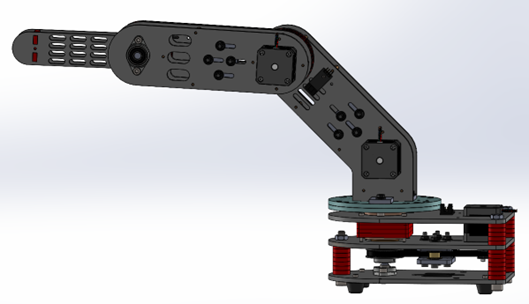

 <h1 align="center">Robotics in Practice Project</h1>

# Introduction
This project designs and constructs a 3-degree-of-freedom robotic arm model. Calculating and testing kinematics, drawing workspaces and planning the trajectory for robots. Then write the program and control the 3-DOF robot in practice.

# Design and construction of a 3-DOF robot arm model
The 3-degree-of-freedom robot arm model is designed on SolidWorks software as shown below:

   
  <i>Robot 3-DOF in Solidworks</i>

The model of 3-DOF robot arm in practice after construction is as follows:

  
  

# Calculation and kinematic testing for 3-DOF robot
* The purpose of the forward kinematics problem is to determine the position of the final action of the manipulator when the joint variables of the manipulator are known.
* The purpose of the inverse kinematics problem is to find the joint variables of the manipulator when the position of the last action of the manipulator is known. There are two methods to solve the inverse kinematics problem: the geometric method and the algebraic method.

   
  <i>PD Fuzzy controller</i>

# Neural Networks (NN)
The neural controller is created based on the signal transmission and processing mechanism of the human brain. The construction of the neural controller is to create an artificial neural network that mimics the working process of the human brain. The essence of an artificial neural network is a distributed parallel computing network.

   
  <i>Predictive neural network model</i>

# Genetic Algorithm (GA)
Genetic Algorithm (GA) is an algorithm that searches for the optimal solution on the principle of guesswork according to the evolutionary process and genetic laws of organisms in nature. In genetic algorithms for optimization problems, the idea is that a set of chromosomes in individuals will be allowed to evolve toward a selection of progressively better solutions.

   
  <i>Genetic Algorithm Flowchart</i>

# Simulation results
Output response of joints (left picture is joint 1, right is joint 2).

* **Fuzzy Logic:**

  
  

* **Neural Networks:**

  
  

* **Genetic Algorithm:**

  
  

# Video Design intelligent controllers for a 2-DOF manipulator
https://youtu.be/SbA-9qXNue8

